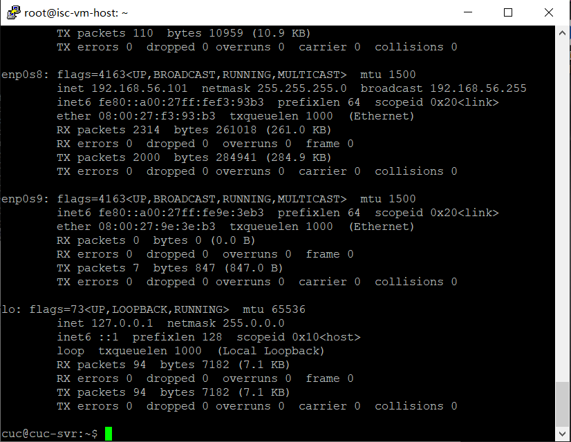

# 第六章：shell脚本编程练习进阶实验

## 实验环境

* Ubuntu18.04 server
    * 工作主机：Ubuntu18.04 

      ​					cuc@cuc-svr	IP：192.168.56.101

    * 目标主机：Ubuntu18.04

      ​					cuc@isc-vm-host	IP：192.168.56.103

* putty

## 实验要求
* FTP
  
    * 对照第6章课件中的要求选择一款合适的FTP服务器软件支持所有任务要求
* NFS
  
    * 对照第6章课件中的NFS服务器配置任务
* DHCP
  
    * 2台虚拟机使用Internal网络模式连接，其中一台虚拟机上配置DHCP服务，另一台服务器作为DHCP客户端，从该DHCP服务器获取网络地址配置
* Samba
  
    * 对照第6章课件中smbclient一节的3点任务要求完成Samba服务器配置和客户端配置连接测试
* DNS
    * 基于上述Internal网络模式连接的虚拟机实验环境，在DHCP服务器上配置DNS服务，使得另一台作为DNS客户端的主机可以通过该DNS服务器进行DNS查询
    * 在DNS服务器上添加 zone "cuc.edu.cn" 的以下解析记录
        ```
        ns.cuc.edu.cn NS
        ns A <自行填写DNS服务器的IP地址>
        wp.sec.cuc.edu.cn A <自行填写第5章实验中配置的WEB服务器的IP地址>
        dvwa.sec.cuc.edu.cn CNAME wp.sec.cuc.edu.cn
        ```

## 实验步骤

### 1. 工作主机免密SSH登录目标主机

目标主机：

```
# 开启SSH服务
sudo service ssh start

# 修改配置文件
sudo vim /etc/ssh/sshd_config

# 添加
# 允许root用户登录
PermitRootLogin yes
# 设置可通过口令认证SSH
PasswordAuthentication yes
# 保存后退出vim

# 重启目标主机的SSH服务
sudo systemctl restart ssh
```

工作主机：

```
# 生成ssh-key,xxx为Key的名称
ssh-keygen -f xxx

# 工作主机通过ssh-copy-id方式导入ssh-key
ssh-copy-id -i xxx cuc@192.168.56.103
```

免密配置（目标主机）:

```
# 取消root口令并禁用口令登录

# 修改目标主机配置文件
vim /etc/ssh/sshd_config
# 修改
PasswordAuthentication no
PermitRootLogin without-password

# 重启ssh服务
sudo systemctl restart ssh
```

免密登录：

```
ssh -i xxx root@192.168.56.103

#配置完成后每次还提示”Enter passphrase for key ‘xxx’:“(仅本次登录有效)
eval $(ssh-agent)
ssh-add foo
# 也可以将代码添加到文件~/.bash_profile中，以后就不用再输入
```


### 2.FTP

实验工具：vsftpd

脚本文件：[vsftpd.sh](code/vsftpd.sh)

配置文件：[vsftpd.conf](code/vsftpd.conf)

* 通过工作主机运行脚本在目标主机安装vsftpd并完成相关配置

  ```
  #将脚本文件vsftpd.sh拷贝到目标主机
  cuc@cuc-svr:~$scp -i xxx vsftpd.sh root@192.168.56.103:workspace/
  
  #实现目标主机控制安装和配置
  ssh -i xxx root@192.168.56.103 'bash workspace/vsftpd.sh'
  ```


* 配置一个提供匿名访问的FTP服务器，匿名访问者可以访问1个目录且仅拥有该目录及其所有子目录的只读访问权限


* 配置一个支持用户名和密码方式访问的账号，该账号继承匿名访问者所有权限，且拥有对另1个独立目录及其子目录完整读写（包括创建目录、修改文件、删除文件等）权限，（该账号仅可用于FTP服务访问，不能用于系统shell登录）

  * 访问权限

    

  * 删除文件、创建目录、修改文件

    

* FTP用户不能越权访问指定目录之外的任意其他目录和文件

  

* 匿名访问权限仅限白名单IP来源用户访问，禁止白名单IP以外的访问

  

### 3.NFS

脚本文件：[nfs_s.sh](code/nfs_s.sh)	[nfs_c.sh](code/nfs_c.sh)

配置文件：[exports](code/exports)

* 通过工作主机运行脚本在目标主机安装vsftpd并完成相关配置

  * 将`nfs_s.sh`拷贝到目标主机，工作主机运行`nfs_s.sh`脚本

    ```
    cuc@cuc-svr:~$scp -i xxx nfs_s.sh root@192.168.56.103:workspace/
    
    ssh -i xxx root@192.168.56.103 'bash workspace/nfs_s.sh'
    ```

  * 在工作主机运行`nfs_c.sh`脚本

    ```
    sudo bash nfs_c.sh
    ```

    

* 在1台Linux上配置NFS服务，另1台电脑上配置NFS客户端挂载2个权限不同的共享目录，分别对应只读访问和读写访问权限

  * 创建的两个目录分别为:只读--`/nfs/gen_r`和读写--`/nfs/gen_rw`

    

  * 两个共享文件目录对应只读和读写访问权限

    

* 共享目录中文件、子目录的属主、权限信息

  

* [根据资料](https://www.digitalocean.com/community/tutorials/how-to-set-up-an-nfs-mount-on-ubuntu-18-04)添加两个/home下的共享目录，分别设置no_root_squash和不设置no_root_squash

  对于设置了no_root_squash的共享目录

  工作主机：

  

  目标主机：

  

  * 没有设置过`no_root_squash`的共享目录，无法在工作机器(client)写入文件，创建目录

    工作主机：

    

    目标主机：

    

### 4.DHCP

脚本文件：[dhcp.sh](code/dhcp.sh)

配置文件：[/etc/dhcp/dhcpd.conf](code/dhcpd.conf)	[/etc/default/isc-dhcp-server](code/isc-dhcp-server)

目标主机配置dhcp服务器端，工作主机配置dhcp客户端

* 新增网卡（内部网络）

  服务端

  ``` 
  ssh -i xxx root@192.168.56.103 'bash workspace/dhcp.sh'
  ssh -i xxx root@192.168.56.103 'less /etc/netplan/01-netcfg.yaml'
  ```

  

  客户端

  ```
  #修改配置文件
  sudo vim /etc/netplan/01-netcfg.yaml
  #添加
  enp0s9:
    dhcp4: yes
  
  #查看配置文件
  less /etc/netplan/01-netcfg.yaml
  ```

  

  ```
  sudo netplan apply
  
  ifconfig
  ```

  

  实验结果：失败，仍为failed（未解决）

  

### 5.DNS

* 目标主机：

  ```
  #安装bind9
  sudo apt install bind9
  
  #修改配置文件
  sudo vim /etc/bind/named.conf.options
  #修改内容
  #在options选项中增加
  listen-on { 192.168.56.103; }; 
  allow-transfer { none; }; 
  forwarders {
     8.8.8.8;
      8.8.4.4;
  };
  
  #修改配置文件
  sudo vim /etc/bind/named.conf.local
  #修改内容
  #增加
  zone "cuc.edu.cn" {
      type master;
      file "/etc/bind/db.cuc.edu.cn";
  };
  
  #生成文件db.cuc.edu.cn
  sudo cp /etc/bind/db.local /etc/bind/db.cuc.edu.cn
  
  #修改文件db.cuc.edu.cn
  sudo vim /etc/bind/db.cuc.edu.cn
  #修改内容
  ;@      IN      NS      localhost.
  ;@      IN      A       127.0.0.1
  ;@      IN      AAAA    ::1
  
          IN      NS      ns.cuc.edu.cn
  ns      IN      A       192.168.56.103
  wp.sec.cuc.edu.cn.      IN      A       192.168.56.103
  dvwa.sec.cuc.edu.cn.    IN      CNAME   wp.sec.cuc.edu.cn.
  
  #重启bind9
  sudo service bind9 restart
  ```

* 工作主机：

  ```
  #安装resolvconf
  sudo apt update && sudo apt install resolvconf
  
  #修改配置文件
  sudo vim /etc/resolvconf/resolv.conf.d/head
  #修改内容
  #增加 
  search cuc.edu.cn
  nameserver 192.168.57.1
  
  #保存更改
  sudo resolvconf -u
  ```

* 实验结果：失败，未解决

  

### 6.Samba

脚本文件：sabma.sh

配置文件：/ect/sabma/sabma.conf

* 运行脚本文件：

  ``` 
  sudo bash sabma.sh
  ```

  

* 打开资源管理器，右键“此电脑”，选择“添加一个网络位置”

  

  

* 在linux上连接window上的服务器

  ```
  #下载smbclient
  sudo apt-get install smbclient
  
  #查看共享目录
  sudo smbclient -L 192.168.56.103 -U Administer
  ```

  

  

## 参考资料

1. [linux-2019-luyj](https://github.com/CUCCS/linux-2019-luyj/blob/Linux_exp0x06/Linux_exp0x06/Linux_exp0x06.md)

2. [linux-2020-cuc-Lynn](https://github.com/CUCCS/linux-2020-cuc-Lynn/blob/chap0x06/chap0x06实验报告.md)

3. [ubuntu无法更新的问题](https://blog.csdn.net/weixin_38504735/article/details/102979883)

4. [vsftp上传文件出现553 Could not create file解决方法](http://www.cnblogs.com/cmustard/p/6769912.html)

5. [Setting up Samba as a Standalone Server](https://wiki.samba.org/index.php/Setting_up_Samba_as_a_Standalone_Server)

6. [在Windows上访问linux的共享文件夹](https://blog.csdn.net/huayangshiboqi/article/details/85798907)

   

